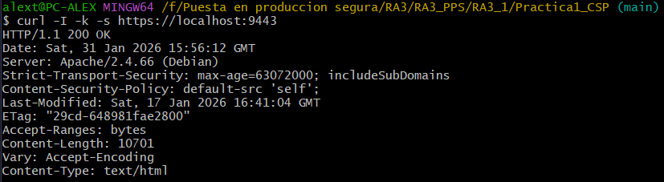

# Práctica 1: CSP

Esta práctica inicial se centra en la reducción de la superficie de ataque del servidor Apache mediante la implementación de cifrado SSL/TLS y la configuración de políticas de seguridad en las cabeceras HTTP.

## 1. Estructura del directorio
El proyecto organiza los activos de seguridad (certificados) y las políticas de endurecimiento en directorios separados.

```text
Practica1_CSP/
├── conf/                   # Configuraciones de seguridad
│   ├── default-ssl.conf    # VirtualHost configurado para puerto 443
│   └── user-hardening.conf # Cabeceras CSP, HSTS y control de índices
├── ssl/                    # Infraestructura de clave pública (PKI)
│   ├── apache.crt          # Certificado auto-firmado
│   └── apache.key          # Clave privada RSA
├── Dockerfile              # Construcción basada en Debian con Apache2
└── README.md
```

## 2. Archivos de configuración

### **A. VirtualHost SSL (`default-ssl.conf`)**
Configura el motor SSL y vincula los certificados del servidor:
* **SSLEngine on**: Activa el cifrado para el host.
* **SSLCertificateFile**: Ruta al certificado público.
* **SSLCertificateKeyFile**: Ruta a la clave privada generada.

### **B. Hardening y CSP (`user-hardening.conf`)**
Define las políticas de protección para el navegador del cliente:
* **Strict-Transport-Security (HSTS)**: Fuerza al navegador a usar siempre conexiones HTTPS durante 2 años (`max-age=63072000`).
* **Content-Security-Policy (CSP)**: Establece `default-src 'self'`, permitiendo carga de recursos únicamente desde el mismo origen del servidor.
* **Options -Indexes**: Bloquea el listado automático de archivos en directorios sin un `index.html`.

### **C. Certificados (SSL)**
Se ha generado un par de llaves RSA para habilitar el protocolo HTTPS de forma local.

## 3. Dockerfile
El despliegue utiliza una imagen ligera de Debian. Automatiza la habilitación de módulos críticos y aplica el principio de mínimo privilegio eliminando módulos innecesarios como `autoindex`.

```Dockerfile
FROM debian:bookworm-slim

# Instalación de paquetes básicos
RUN apt-get update && apt-get install -y \
    apache2 \
    openssl \
    curl \
    && apt-get clean \
    && rm -rf /var/lib/apt/lists/*

# Habilitar módulos de seguridad y cifrado
RUN a2enmod ssl headers rewrite

# Deshabilitar el listado de directorios
RUN a2dismod -f autoindex

# Crear directorio para certificados
RUN mkdir -p /etc/apache2/ssl

# Copiamos la infraestructura de seguridad
COPY ssl/apache.key /etc/apache2/ssl/
COPY ssl/apache.crt /etc/apache2/ssl/

# Copiamos las reglas de Hardening (CSP, HSTS)
COPY conf/user-hardening.conf /etc/apache2/conf-available/user-hardening.conf

# Copiamos el VirtualHost SSL
COPY conf/default-ssl.conf /etc/apache2/sites-available/default-ssl.conf

RUN a2enconf user-hardening && a2ensite default-ssl

EXPOSE 80 443

CMD ["apache2ctl", "-D", "FOREGROUND"]
```

## 4. Despliegue y uso

### A. Construcción de la imagen
```bash
docker build -t victorteleanu/pps:pr1 .
```

### B. Subir la imagen a DockerHub
```bash
docker push victorteleanu/pps:pr1
```

### C. Despliegue del contenedor
```bash
docker run -d --name practica1_test -p 9001:80 -p 9443:443 victorteleanu/pps:pr1
```

## 5. Verificación

Se utiliza `curl` para inspeccionar las cabeceras de seguridad y validar que el servidor responde correctamente bajo HTTPS.

### **Verificacioón de cabeceras de seguridad**

```bash
curl -I -k -s https://localhost:9443
```

**Resultado esperado**: `Strict-Transport-Security` y `Content-Security-Policy` presentes. `Server` muestra la versión estándar de Debian/Apache.

**Evidencia:**



## 6. DockerHub

La imagen final se encuentra en el siguiente enlace:

**[victorteleanu/pps:pr1](https://hub.docker.com/repository/docker/victorteleanu/pps/tags/pr1)**

