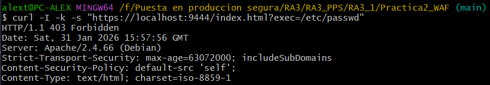

# Práctica 2: Web Application Firewall (WAF)

Esta práctica introduce una capa de seguridad activa mediante el despliegue de **ModSecurity v2**. El objetivo es configurar un cortafuegos de aplicaciones web capaz de inspeccionar el tráfico entrante y mitigar ataques comunes.

---

## 1. Estructura del directorio
El proyecto hereda la base de seguridad de la Práctica 1 e incluye la configuración personalizada del WAF.

```text
Practica2_WAF/
├── conf/                       # Configuraciones de seguridad
│   └── modsecurity_custom.conf # Parámetros del motor ModSecurity
├── Dockerfile                  # Construcción basada en la imagen pps:pr1
└── README.md
```

---

## 2. Archivos de configuración

### **A. ModSecurity personalizado (`modsecurity_custom.conf`)**
Define el comportamiento del motor de reglas y los límites de procesamiento de datos:
* **SecRuleEngine On**: Activa el motor de reglas en modo preventivo (bloqueo activo).
* **Límites de Cuerpo (Request Body)**: Se establecen límites estrictos para prevenir ataques de denegación de servicio por agotamiento de memoria:
    * `SecRequestBodyLimit`: 12.5 MB máximo para el cuerpo de la petición.
    * `SecRequestBodyInMemoryLimit`: 128 KB para procesamiento en memoria RAM.
* **SecResponseBodyLimit**: 512 KB máximo para la respuesta del servidor.

### **B. Base de reglas recomendada**
Se utiliza como base el archivo `modsecurity.conf-recommended` proporcionado por el paquete oficial, el cual se adapta para activar la protección activa.

---

## 3. Dockerfile
La imagen se construye partiendo de `victorteleanu/pps:pr1`, garantizando que todas las protecciones previas se mantengan.

```Dockerfile
FROM victorteleanu/pps:pr1

# Instalar el módulo ModSecurity para Apache
RUN apt-get update && apt-get install -y \
    libapache2-mod-security2 \
    && apt-get clean \
    && rm -rf /var/lib/apt/lists/*

# Configuración base oficial
RUN cp /etc/modsecurity/modsecurity.conf-recommended /etc/modsecurity/modsecurity.conf

# Aplicar nuestra configuración personalizada
COPY conf/modsecurity_custom.conf /etc/apache2/conf-available/modsecurity_custom.conf

# Habilitar el módulo y la nueva configuración
RUN a2enmod security2 && a2enconf modsecurity_custom
```

---

## 4. Despliegue y uso

### A. Construcción de la imagen
```bash
docker build -t victorteleanu/pps:pr2 .
```

### B. Subir la imagen a DockerHub
```bash
docker push victorteleanu/pps:pr2
```

### C. Despliegue del contenedor
```bash
docker run -d --name practica2_test -p 9002:80 -p 9444:443 victorteleanu/pps:pr2
```

---

## 5. Verificación

Se realiza una prueba de inyección de parámetros sospechosos (Path Traversal) para validar que el WAF intercepta peticiones maliciosas.

### **Validación de bloqueo por ModSecurity**
Se intenta acceder a un archivo sensible del sistema (`/etc/passwd`) mediante un parámetro en la URL.
```bash
curl -I -k -s "https://localhost:9444/index.html?exec=/etc/passwd"
```

**Resultado esperado**: El servidor debe responder con un código `HTTP/1.1 403 Forbidden`, indicando que ModSecurity ha interceptado y bloqueado la petición por violar las políticas de seguridad.

**Evidencia:**



---

## 6. DockerHub

La imagen final se encuentra en el siguiente enlace:

**[victorteleanu/pps:pr2](https://hub.docker.com/repository/docker/victorteleanu/pps/tags/pr2)**