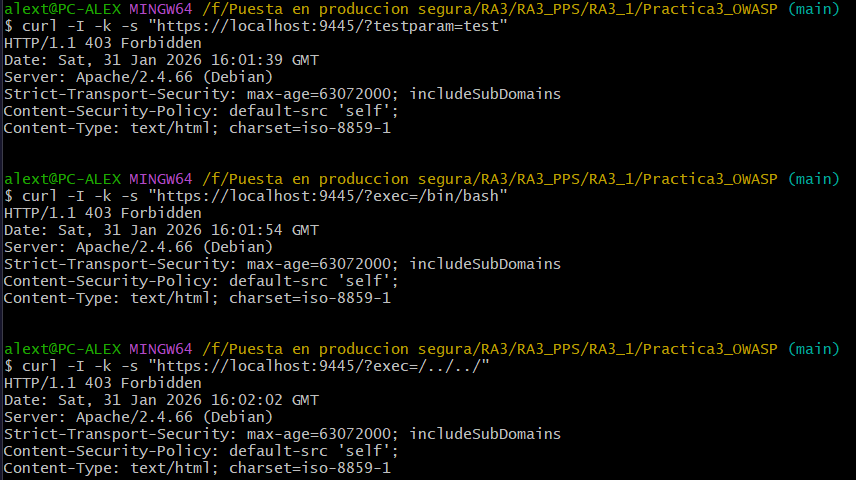

# Práctica 3: OWASP Core Rule Set (CRS)

En esta práctica se eleva el nivel de protección del WAF mediante la implementación del **OWASP ModSecurity Core Rule Set (CRS)**. Este conjunto de reglas genéricas de detección de ataques se utiliza para proteger aplicaciones web de una amplia gama de ataques, incluidos los diez riesgos principales de OWASP (SQLi, XSS, LFI, etc.).

## 1. Estructura del directorio
El proyecto integra el motor de ModSecurity configurado anteriormente con las reglas oficiales de SpiderLabs.

```text
Practica3_OWASP/
├── conf/                       # Configuraciones de seguridad
│   ├── owasp-testing.conf      # Regla personalizada de prueba
│   └── security2.conf          # Orquestador de carga de reglas CRS
├── Dockerfile                  # Construcción basada en pps:pr2 con clonación de reglas
└── README.md
```

## 2. Archivos de configuración

### **A. Regla de Prueba Personalizada (`owasp-testing.conf`)**
Se ha implementado una regla específica para verificar el funcionamiento del motor antes de la carga masiva:
* **SecRule ARGS:testparam "@contains test"**: Intercepta cualquier petición que contenga la cadena "test" en el parámetro `testparam`.
* **msg:'Cazado por Ciberseguridad'**: Mensaje personalizado que se registra en el log de auditoría al producirse el bloqueo (403).

### **B. Orquestador de Reglas (`security2.conf`)**
Este archivo actúa como el punto de entrada para Apache:
* **SecDataDir**: Define el directorio de persistencia para datos del WAF.
* **IncludeOptional /etc/modsecurity/*.conf**: Carga la configuración base.
* **Include /etc/modsecurity/rules/*.conf**: Carga de forma recursiva todas las reglas oficiales de OWASP (SQLi, XSS, inyección de comandos, etc.).

## 3. Dockerfile
La imagen se construye sobre `pps:pr2`, integrando `git` para descargar las reglas actualizadas y realizando una limpieza posterior para optimizar el tamaño de la imagen final.

```Dockerfile
FROM victorteleanu/pps:pr2

# Instalamos git temporalmente para bajar las reglas
RUN apt-get update && apt-get install -y git && \
    git clone https://github.com/SpiderLabs/owasp-modsecurity-crs.git /tmp/owasp-modsecurity-crs

# Preparamos el directorio de reglas según tus instrucciones
RUN mkdir -p /etc/modsecurity/rules && \
    cp /tmp/owasp-modsecurity-crs/crs-setup.conf.example /etc/modsecurity/crs-setup.conf && \
    cp /tmp/owasp-modsecurity-crs/rules/*.conf /etc/modsecurity/rules/ && \
    cp /tmp/owasp-modsecurity-crs/rules/*.data /etc/modsecurity/rules/

# Limpiamos para que la imagen sea ligera
RUN rm -rf /tmp/owasp-modsecurity-crs && apt-get purge -y git && apt-get autoremove -y

# Copiamos nuestra configuración que carga las reglas y la regla de test
COPY conf/security2.conf /etc/apache2/mods-available/security2.conf
COPY conf/owasp-testing.conf /etc/apache2/conf-available/owasp-testing.conf

# Habilitamos la configuración de testing
RUN a2enconf owasp-testing

EXPOSE 80 443
```

## 4. Despliegue y uso

### A. Construcción de la imagen
```bash
docker build -t victorteleanu/pps:pr3 .
```

### B. Subir la imagen a DockerHub
```bash
docker push victorteleanu/pps:pr3
```

### C. Despliegue del contenedor
```bash
docker run -d --name practica3_test -p 9003:80 -p 9445:443 victorteleanu/pps:pr3
```

## 5. Verificación

Se realizan múltiples pruebas para validar tanto la regla personalizada como la protección global de OWASP contra ataques de sistema.

### **A. Verififcación de regla personalizada**
```bash
curl -I -k -s "https://localhost:9445/?testparam=test"
```

**Resultado esperado**: `HTTP/1.1 403 Forbidden`.

### **B. Verificación de inyección de comandos**
```bash
curl -I -k -s "https://localhost:9445/?exec=/bin/bash"
```

**Resultado esperado**: `HTTP/1.1 403 Forbidden`.

### **C. Verificación de Path Traversal profundo**
```bash
curl -I -k -s "https://localhost:9445/?exec=/../../"
```

**Resultado esperado**: `HTTP/1.1 403 Forbidden`.

**Evidencia:**



## 6. DockerHub

La imagen final se encuentra en el siguiente enlace:

**[victorteleanu/pps:pr3](https://hub.docker.com/repository/docker/victorteleanu/pps/tags/pr3)**