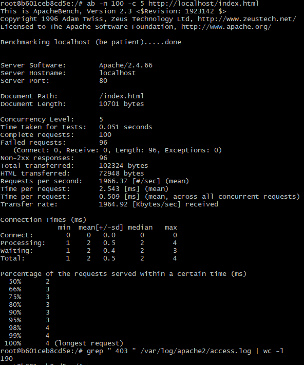

# 🛡️ Práctica 4: Evitar ataques DDOS

En esta fase hemos blindado el servidor contra ataques de **Denegación de Servicio (DoS)** y fuerza bruta. Utilizando el módulo **mod_evasive**, el servidor ahora actúa como un limitador de tráfico (rate-limiter), bloqueando temporalmente a cualquier IP que supere los umbrales de peticiones permitidos.

## 📂 Estructura del directorio

```text
Practica4_Evasive/
├── Dockerfile                # Herencia de pps:pr3 + mod_evasive
└── conf/
    └── evasive.conf          # Configuración de umbrales de bloqueo
```
## ⚙️ Configuración realizada

### A. Definición de umbrales (evasive.conf)
Se han establecido los parámetros de detección siguiendo el manual técnico facilitado para garantizar un bloqueo reactivo pero estable:

* **DOSPageCount**: 5 (Límite de peticiones a la misma URI por segundo).
* **DOSSiteCount**: 100 (Límite de peticiones totales al sitio por segundo).
* **DOSBlockingPeriod**: 10 (Segundos de baneo tras detectar el abuso).
* **DOSLogDir**: `/var/log/mod_evasive`.

### B. Gestión de permisos de auditoría
El módulo requiere permisos de escritura en el sistema de archivos para marcar las IPs en cuarentena y generar los archivos de bloqueo:

* **Comando**: `chown -R root:www-data /var/log/mod_evasive`

## 🛠️ Dockerfile

```dockerfile
FROM victorteleanu/pps:pr3

# Instalación del módulo mod_evasive
RUN apt-get update && apt-get install -y libapache2-mod-evasive && apt-get clean

# Creación del directorio de logs y asignación de dueño
RUN mkdir -p /var/log/mod_evasive && \
    chown -R root:www-data /var/log/mod_evasive

# Aplicar nuestra configuración personalizada
COPY conf/evasive.conf /etc/apache2/mods-available/evasive.conf

# Habilitar el módulo evasive
RUN a2enmod evasive

EXPOSE 80 443
```

## 🔍 Validación

Para verificar la protección contra denegación de servicio, se ha lanzado una ráfaga de 100 peticiones con una concurrencia de 5, simulando un intento de saturación del servidor:

```bash
# Prueba de carga desde el interior del contenedor
ab -n 100 -c 5 http://localhost/index.html
```

### Resultados de la prueba

| Métrica | Valor Real Obtenido |
| :--- | :--- |
| **Peticiones Totales** | 100 |
| **Peticiones Fallidas** | **94**  |
| **Tiempo Total** | 0.049 segundos |
| **Código de Respuesta** | **403 Forbidden** |

### Verificación por comandos de sistema

Para confirmar que el bloqueo fue ejecutado específicamente por el módulo **mod_evasive**, se contabilizan las denegaciones registradas en el log de acceso de Apache:

```bash
# Conteo de peticiones bloqueadas con código 403
grep " 403 " /var/log/apache2/access.log | wc -l
```



**Resultado**: El comando debería devolver **94**, coincidiendo exactamente con el reporte de fallos generado por **Apache Bench**. En este caso devuelve 190 debido a que se ha lanzado más de una vez.

## 🌐 Docker Hub

Imagen disponible para su despliegue de forma rápida:

| Campo | Valor |
| :--- | :--- |
| **Repositorio** | `victorteleanu/pps` |
| **Etiqueta (Tag)** | `pr4` |
| **Comando Pull** | `docker pull victorteleanu/pps:pr4` |