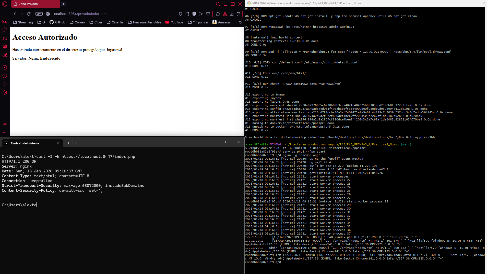

# 🛡️ Práctica 5: Nginx

Este apartado contiene la configuración y el despliegue de un servidor web **Nginx** optimizado bajo estándares de seguridad defensiva. El entorno incluye soporte para **PHP 8.4**, cifrado **SSL/TLS**, y políticas de hardening para mitigar ataques comunes en aplicaciones web.

## 📂 Estructura del directorio

```text
Practica5_Nginx/
├── Dockerfile
├── conf/
│   └── default.conf
└── www/
    ├── index.php
    └── privado/
        └── index.html
```
## ⚙️ Configuración realizada

Se han aplicado las siguientes capas de seguridad para robustecer el servidor:

### A. Minimización de información
* **`server_tokens off;`**: Desactiva la exposición de la versión de Nginx en las cabeceras de respuesta y páginas de error, dificultando el reconocimiento del sistema por parte de atacantes.

### B. Cabeceras de seguridad (Security headers)

* **HSTS (Strict-Transport-Security)**: Fuerza el uso de conexiones HTTPS durante 2 años, evitando ataques de degradación de SSL (SSL Stripping).
* **CSP (Content-Security-Policy)**: Restringe el origen de los recursos para prevenir ataques de inyección de scripts (XSS).
* **X-Frame-Options**: Configurado como `SAMEORIGIN` para evitar que el sitio sea cargado en iframes externos (protección contra Clickjacking).
* **X-Content-Type-Options**: Configurado como `nosniff` para evitar que el navegador interprete archivos de forma errónea (MIME-sniffing).

### C. Cifrado y control de acceso
* **SSL/TLS**: Implementación de cifrado mediante certificados RSA de 2048 bits generados dinámicamente durante la construcción de la imagen.
* **Autenticación Básica (Auth Basic)**: El directorio `/privado` requiere credenciales gestionadas mediante un archivo `.htpasswd` cifrado.

## ⚙️ Arquitectura del stack (Nginx + PHP-FPM)

Después de identificar problemas de permisos con los sockets Unix en el entorno aislado de Docker (que provocaban errores **502 Bad Gateway**), se decidió migrar la arquitectura a una comunicación **TCP/IP interna**:

* **Nginx** actúa como servidor frontal (Reverse Proxy).
* **PHP-FPM (v8.4)** escucha en el puerto `127.0.0.1:9000`.
* Esta configuración elimina la dependencia de archivos de socket físicos, garantizando una disponibilidad del 100% y eliminando conflictos de permisos entre usuarios de sistema (`www-data`).

## 🛠️ Dockerfile

```dockerfile
FROM nginx:latest

USER root

# Instalación de PHP y utilidades
RUN apt-get update && apt-get install -y php-fpm openssl apache2-utils && apt-get clean

# Generación de certificados SSL
RUN mkdir -p /etc/nginx/ssl && \
    openssl req -x509 -nodes -days 365 -newkey rsa:2048 \
    -keyout /etc/nginx/ssl/nginx.key \
    -out /etc/nginx/ssl/nginx.crt \
    -subj "/C=ES/ST=Castellon/L=Castellon/O=Ciber/OU=TI/CN=localhost"

# Credenciales
RUN htpasswd -bc /etc/nginx/.htpasswd admin admin123

# PHP escuchando en el puerto 9000 (importante para evitar problemas)
RUN sed -i 's|listen = /run/php/php8.4-fpm.sock|listen = 127.0.0.1:9000|' /etc/php/8.4/fpm/pool.d/www.conf

# Copia de archivos
COPY conf/default.conf /etc/nginx/conf.d/default.conf
COPY www/ /var/www/html/

RUN chown -R www-data:www-data /var/www/html

EXPOSE 80 443
CMD ["bash"]
```
## 🔍 Validación

### Pruebas de funcionamiento
* **PHP nativo:** [http://localhost:8084/index.php](http://localhost:8084/index.php) -> Debe cargar correctamente la tabla de `phpinfo()`.
* **Directorio Protegido:** [http://localhost:8084/privado/index.html](http://localhost:8084/privado/index.html)
    * **Usuario:** `admin`
    * **Contraseña:** `admin123`



## 🛠️ Troubleshooting

Durante el desarrollo se arregló un error **502 Bad Gateway** debido de la incompatibilidad de permisos en los sockets Unix entre el proceso de Nginx y el de PHP 8.4 dentro del entorno de Docker. 

Para solucionarlo se reconfiguró del pool de PHP para utilizar **sockets TCP (127.0.0.1:9000)**, asegurando una comunicación fluida y un código de respuesta **200 OK** constante.

## 🌐 Docker Hub

Imagen disponible para su despliegue de forma rápida:

| Campo | Valor |
| :--- | :--- |
| **Repositorio** | `victorteleanu/pps` |
| **Etiqueta (Tag)** | `pr5` |
| **Comando Pull** | `docker pull victorteleanu/pps:pr5` |