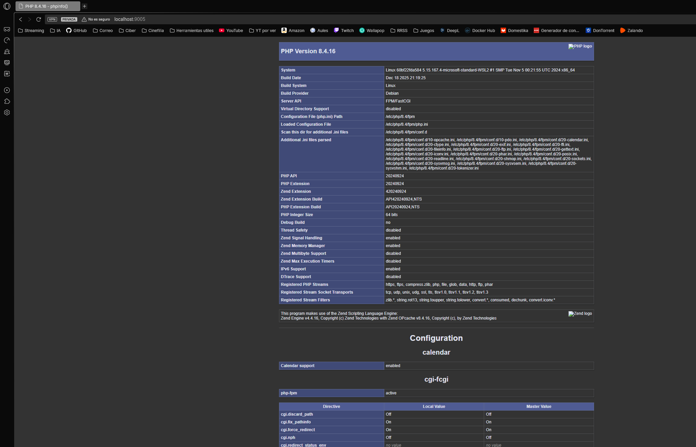

# Práctica 5: Optimización y Hardening con Nginx + PHP 8.4

En esta práctica se realiza una migración tecnológica de Apache a **Nginx** para implementar una arquitectura más eficiente basada en **PHP-FPM**. Se introducen capas de autenticación a nivel de servidor y se resuelve la comunicación entre servicios mediante sockets TCP.

## 1. Estructura del directorio
El proyecto organiza las configuraciones del servidor web y los scripts de backend, junto con el despliegue de contenido estático y dinámico.

```text
Practica5_Nginx/
├── conf/                   # Configuraciones de servidor
│   └── default.conf        # Servidor Nginx (SSL, Hardening y FastCGI)
├── www/                    # Contenido de la aplicación
│   ├── index.html          # Zona privada estática
│   └── index.php           # Verificación de entorno PHP
├── Dockerfile              # Construcción basada en Nginx con PHP-FPM 8.4
└── README.md
```

## 2. Archivos de configuración

### **A. Servidor Nginx (`default.conf`)**
Se configura el servidor para actuar como terminación SSL y proxy inverso para PHP:
* **server_tokens off**: Oculta la versión de Nginx en las cabeceras para evitar el reconocimiento del sistema.
* **Autenticación Básica**: Implementa `auth_basic` vinculado a un archivo `.htpasswd` para restringir el acceso a todo el sitio.
* **PHP-FPM vía TCP**: Se configura `fastcgi_pass 127.0.0.1:9000` para garantizar una comunicación estable y evitar errores de permisos comunes en sockets Unix (502 Bad Gateway).
* **Cabeceras HSTS y CSP**: Se replican las políticas de seguridad en cada bloque `location` para asegurar su envío persistente al navegador.

### **B. Backend PHP (`index.php`)**
Se incluye un script para verificar la correcta ejecución del motor PHP 8.4 y la integración FastCGI mediante la función `phpinfo()`.

## 3. Dockerfile
El despliegue integra el servidor web y el procesador de PHP en un único contenedor, automatizando la creación de credenciales y certificados.

```Dockerfile
FROM nginx:latest

USER root

# Instalación de PHP y utilidades
RUN apt-get update && apt-get install -y php-fpm openssl apache2-utils && apt-get clean

# Generación de certificados SSL
RUN mkdir -p /etc/nginx/ssl && \
    openssl req -x509 -nodes -days 365 -newkey rsa:2048 \
    -keyout /etc/nginx/ssl/nginx.key \
    -out /etc/nginx/ssl/nginx.crt \
    -subj "/C=ES/ST=Castellon/L=Castellon/O=Ciber/OU=TI/CN=localhost"

# Credenciales
RUN htpasswd -bc /etc/nginx/.htpasswd admin admin123

# PHP escuchando en el puerto 9000 (importante para evitar problemas)
RUN sed -i 's|listen = /run/php/php8.4-fpm.sock|listen = 127.0.0.1:9000|' /etc/php/8.4/fpm/pool.d/www.conf

# Copia de archivos
COPY conf/default.conf /etc/nginx/conf.d/default.conf
COPY www/ /var/www/html/

RUN chown -R www-data:www-data /var/www/html

EXPOSE 80 443
CMD service php8.4-fpm start && nginx -g "daemon off;"
```

## 4. Despliegue y uso

### A. Construcción de la imagen
```bash
docker build -t victorteleanu/pps:pr5 .
```

### B. Subir la imagen a DockerHub
```bash
docker push victorteleanu/pps:pr5
```

### C. Despliegue del contenedor
```bash
docker run -d --name practica5_test -p 9005:443 victorteleanu/pps:pr5
```

## 5. Verificación

### **A. Validación de autenticación**
Al acceder al servidor, el navegador debe solicitar las credenciales configuradas (`admin` / `admin123`).
* **URL**: `https://localhost:9005`
* **Resultado esperado**: Bloqueo de acceso hasta el login exitoso.
* **Evidencia**:


### **B. Verificación de entorno PHP 8.4**
Tras la autenticación, se comprueba que el servidor procesa archivos `.php` correctamente.
* **Resultado esperado**: Visualización de la página de configuración de PHP con Server API: **FPM/FastCGI**.
* **Evidencia**:



## 6. DockerHub

La imagen final se encuentra en el siguiente enlace:

**[victorteleanu/pps:pr7](https://hub.docker.com/repository/docker/victorteleanu/pps/tags/pr5)**