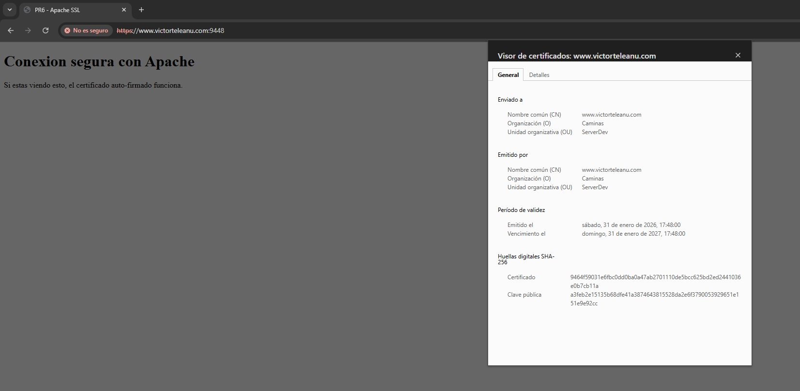

# Práctica 6: Certificados y Redirecciones de Dominio

Esta práctica se centra en la implementación de una infraestructura de clave pública (PKI) propia y el control de tráfico mediante nombres de dominio (FQDN). El objetivo es asegurar que todo el tráfico sea cifrado y redirigido correctamente hacia el puerto seguro.

## 1. Estructura del directorio
El proyecto organiza las configuraciones del host virtual y el contenido web estático para la verificación de la conexión segura.

```text
Practica6_Certificados/
├── conf/                   # Configuraciones de servidor
│   └── victorteleanu.conf  # VirtualHost con ServerName y Redirección
├── www/                    # Contenido de la aplicación
│   └── index.html          # Interfaz de verificación SSL
├── Dockerfile              # Construcción basada en php:8.2-apache
└── README.md
```

## 2. Archivos de configuración

### **A. VirtualHost Personalizado (`victorteleanu.conf`)**
Define la lógica de encaminamiento basada en nombres:
* **ServerName**: Se establece `www.victorteleanu.com` como el nombre de dominio oficial del servidor.
* **Redirección Permanente (Puerto 80)**: Se fuerza el tráfico HTTP hacia el puerto seguro **9448** mediante un código 301, garantizando que el usuario no navegue por canales inseguros.
* **Configuración SSL (Puerto 443)**: Vincula los certificados generados y desactiva el uso de archivos `.htaccess` (`AllowOverride None`) para mejorar el rendimiento y la seguridad.

### **B. Contenido Web (`index.html`)**
Página sencilla de aterrizaje que confirma visualmente al usuario que la conexión SSL se ha establecido con éxito tras aceptar el certificado auto-firmado.

## 3. Dockerfile
El despliegue automatiza la creación de la identidad digital del servidor utilizando OpenSSL.

```Dockerfile
FROM php:8.2-apache

# Activar el módulo SSL
RUN a2enmod ssl

# Crear subdirectorio y generar certificado auto-firmado
RUN mkdir -p /etc/apache2/ssl && \
    openssl req -x509 -nodes -days 365 -newkey rsa:2048 \
    -keyout /etc/apache2/ssl/apache.key \
    -out /etc/apache2/ssl/apache.crt \
    -subj "/C=ES/ST=Castellon/L=Castellon/O=Caminas/OU=ServerDev/CN=www.victorteleanu.com"

# Configurar y activar el host virtual
COPY conf/victorteleanu.conf /etc/apache2/sites-available/victorteleanu.conf
RUN a2dissite 000-default.conf && a2ensite victorteleanu.conf

# Copiar contenido web
COPY www/ /var/www/html/

EXPOSE 80 443
```

## 4. Despliegue y uso

### A. Construcción de la imagen
```bash
docker build -t victorteleanu/pps:pr6 .
```

### B. Subir la imagen a DockerHub
```bash
docker push victorteleanu/pps:pr6
```

### C. Despliegue del contenedor
```bash
docker run -d --name practica6_test -p 9006:80 -p 9448:443 victorteleanu/pps:pr6
```

## 5. Verificación

Se validan los mecanismos de redirección y la validez del certificado generado.

### **A. Validación de redirección automática**
Al intentar acceder por el puerto inseguro, el servidor debe redirigir al navegador al puerto seguro.
* **URL**: `http://www.victorteleanu.com:9006`
* **Resultado esperado**: Redirección automática a `https://www.victorteleanu.com:9448`.

### **B. Verificación de certificado SSL**
En el propio navegador, acceder a los certificados de la web.
**Resultado esperado**: Conexión exitosa y visualización de los parámetros del certificado.

**Evidencia:**



## 6. DockerHub

La imagen final se encuentra en el siguiente enlace:

**[victorteleanu/pps:pr6](https://hub.docker.com/repository/docker/victorteleanu/pps/tags/pr6)**


