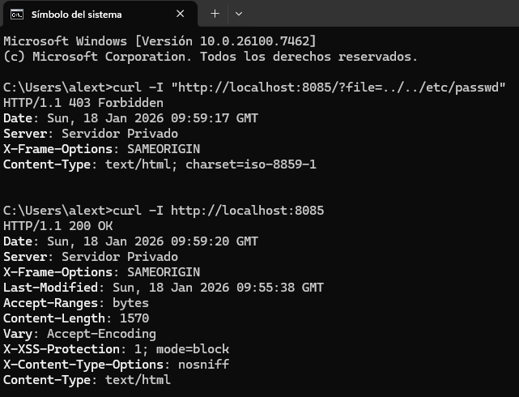

# 🛡️ Práctica 7: Apache Hardening Best Practices

En esta fase hemos contruido una arquitectura de **Defensa en Profundidad**. Partiendo de la base segura de las prácticas anteriores, hemos blindado el núcleo de Apache mediante un proceso de **Hardening** avanzado y la integración de **ModSecurity** como WAF (Web Application Firewall). Esta configuración no solo cifra la información, sino que inspecciona activamente cada petición para neutralizar vectores de ataque complejos antes de que alcancen la aplicación.

## 📂 Estructura del directorio

```text
Practica7_Hardening/
├── Dockerfile
├── conf/
│   ├── hardening.conf
│   ├── security-headers.conf
│   └── modsecurity.conf
└── www/
    └── index.html
```
## ⚙️ Configuración realizada

### A. Hardening y ocultación (hardening.conf)
Se ha configurado el servidor para minimizar la superficie de reconocimiento por parte de atacantes:
* **ServerTokens Prod**: Limita la cabecera `Server` a lo mínimo posible (solo "Apache").
* **ServerSignature Off**: Elimina el pie de página con información del sistema en páginas de error.
* **TraceEnable Off**: Desactiva el método TRACE para prevenir ataques de Cross-Site Tracing (XST).
* **FileETag None**: Evita que se filtren números de inodo del sistema de archivos en las cabeceras.

### B. Inyección de cabeceras (security-headers.conf)
Blindaje del lado del cliente mediante políticas de respuesta activa:
* **X-Frame-Options**: Evita ataques de Clickjacking impidiendo que el sitio se cargue en iframes externos.
* **X-XSS-Protection**: Activa el filtro de scripts maliciosos integrado en el navegador.
* **X-Content-Type-Options**: Previene el MIME-sniffing configurándolo como `nosniff`.

### C. Web Application Firewall - WAF (modsecurity.conf)
Implementación de **ModSecurity v2** como escudo activo frente a ataques de capa de aplicación:
* **SecRuleEngine On**: El motor está en modo de bloqueo real, no solo detección.
* **SecServerSignature**: Se ha personalizado la identidad del servidor a "**Servidor Privado**" para despistar escaneos automáticos.
* **Auditoría**: Registro detallado de cada intento de ataque interceptado en `/var/log/apache2/modsec_audit.log`.

## 🛠️ Dockerfile

```dockerfile
FROM php:8.2-apache

# Instalación de ModSecurity y dependencias necesarias
RUN apt-get update && apt-get install -y \
    libapache2-mod-security2 \
    && apt-get clean

# Aplicar configuraciones de Hardening, Cabeceras y WAF
COPY conf/hardening.conf /etc/apache2/conf-available/hardening.conf
COPY conf/security-headers.conf /etc/apache2/conf-available/security-headers.conf
COPY conf/modsecurity.conf /etc/modsecurity/modsecurity.conf

# Habilitar módulos de Apache y las nuevas configuraciones
RUN a2enmod headers rewrite unique_id security2 && \
    a2enconf hardening security-headers

# Preparación del sistema de Auditoría
RUN touch /var/log/apache2/modsec_audit.log && \
    chown www-data:www-data /var/log/apache2/modsec_audit.log

# Hardening de sistema
RUN chmod -R 750 /etc/apache2 /usr/sbin/apache2

# Despliegue del contenido web y permisos
COPY www/ /var/www/html/
RUN chown -R www-data:www-data /var/www/html

EXPOSE 80
```
## 🔍 Validación

Para verificar el blindaje del servidor, se han realizado pruebas de inyección de código y auditoría de cabeceras desde la terminal de la máquina anfitriona:



### 1. Prueba de bloqueo del WAF (Ataque Path Traversal)
Simulamos un intento de lectura de archivos sensibles del sistema operativo mediante una inyección en la URL:

```bash
curl -I "http://localhost:8085/?file=../../etc/passwd"
```
**Resultado Obtenido:**

```plaintext
HTTP/1.1 403 Forbidden
Server: Servidor Privado
X-Frame-Options: SAMEORIGIN
Content-Type: text/html; charset=iso-8859-1
```

### 2. Prueba de hardening y cabeceras
Verificamos que la identidad del servidor esté totalmente oculta y que las cabeceras de seguridad preventivas estén activas en una petición legítima:

```bash
curl -I http://localhost:8085
```

**Resultado Obtenido:**

```plaintext
HTTP/1.1 200 OK
Date: Sun, 18 Jan 2026 09:59:20 GMT
Server: Servidor Privado
X-Frame-Options: SAMEORIGIN
X-XSS-Protection: 1; mode=block
X-Content-Type-Options: nosniff
Content-Type: text/html
```

## 🌐 Docker Hub

Imagen disponible para su despliegue de forma rápida:

| Campo | Valor |
| :--- | :--- |
| **Repositorio** | `victorteleanu/pps` |
| **Etiqueta (Tag)** | `pr7` |
| **Comando Pull** | `docker pull victorteleanu/pps:pr7` |