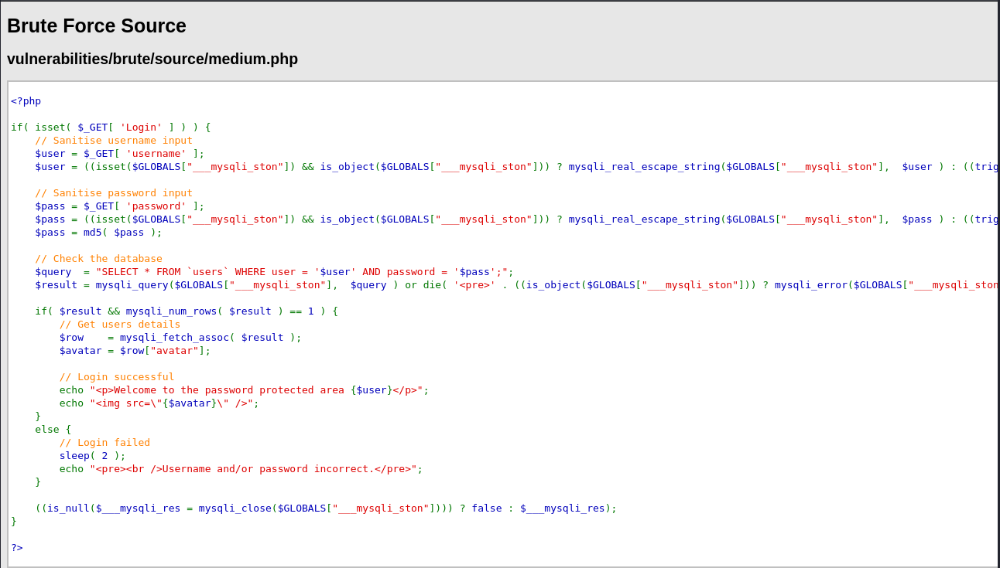
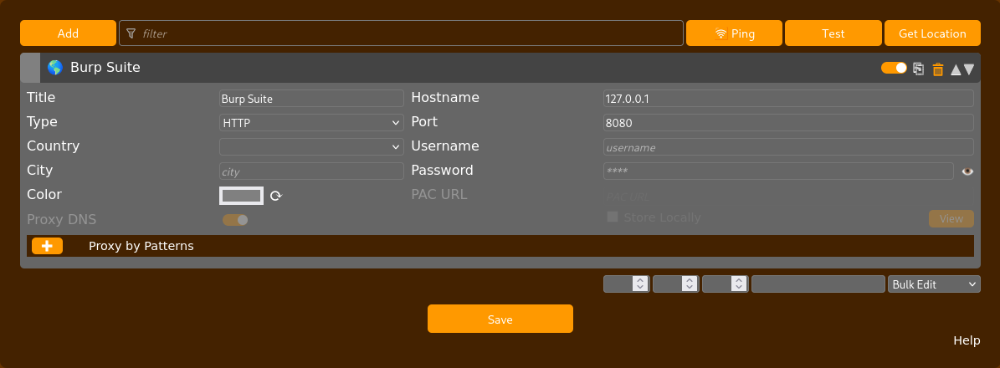
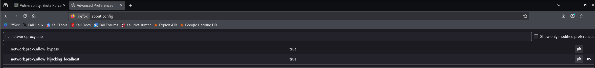
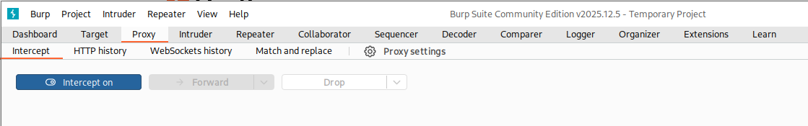
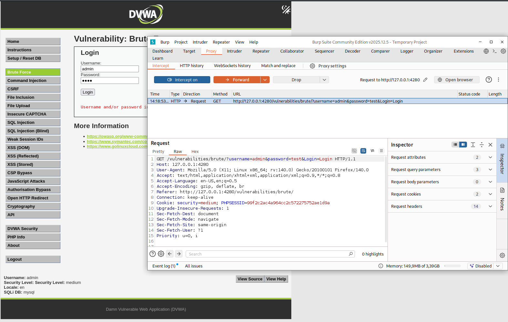
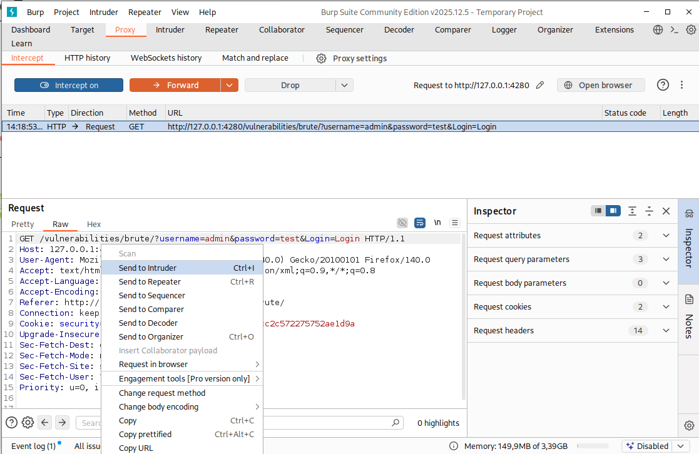
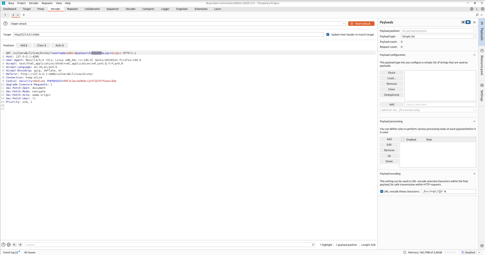
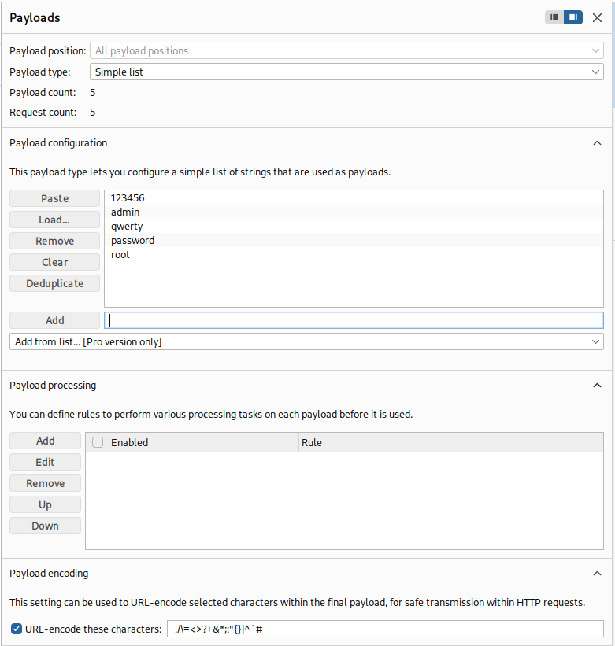
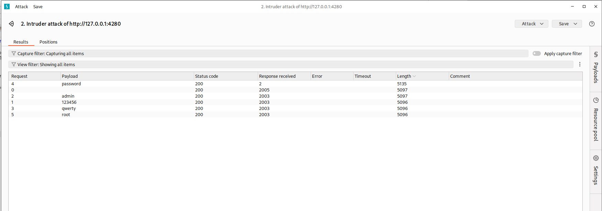
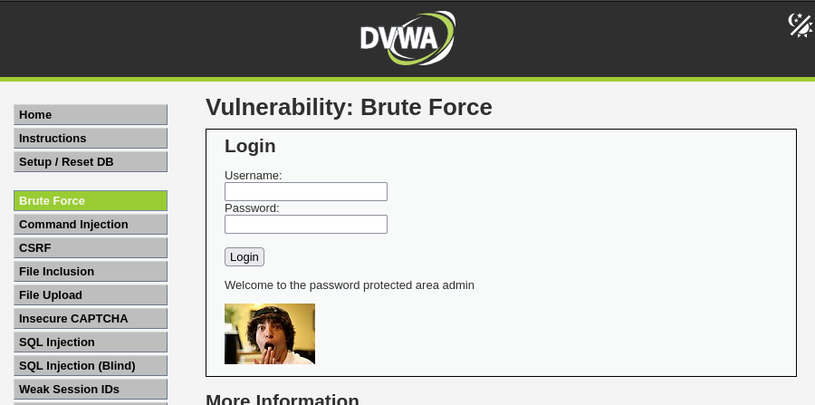

# DVWA Writeup: Brute Force

## 1. Introducción
Un ataque de Fuerza Bruta (Brute Force) consiste en un método de ensayo y error utilizado para adivinar credenciales de acceso (como nombres de usuario y contraseñas). El atacante utiliza herramientas automatizadas para probar combinaciones a partir de diccionarios de palabras comunes hasta dar con la clave correcta que permite el acceso no autorizado al sistema.

---

## 2. Solución Nivel Medium

En el nivel medio de la DVWA, el ataque de fuerza bruta se complica ligeramente mediante la introducción de una medida de seguridad basada en el tiempo. 

### Análisis del código fuente
Si revisamos el código fuente del nivel Medium, podemos observar que los desarrolladores han implementado la función `sleep(2);` cuando el inicio de sesión falla. Esto significa que el servidor se detiene intencionadamente durante 2 segundos por cada intento incorrecto, haciendo que los ataques masivos sean extremadamente lentos.

### Configuración del entorno
Para automatizar este ataque, utilizaremos **Burp Suite**. Primero, configuramos la extensión **FoxyProxy** en nuestro navegador para redirigir el tráfico web hacia nuestra herramienta de intercepción (Burp Suite), apuntando al puerto `127.0.0.1:8080`.
> [!NOTE]
> **¿Qué es FoxyProxy y por qué lo usamos?**
>
> Es una extensión para navegadores web que actúa como un interruptor rápido para gestionar conexiones proxy. En el pentesting, nos ahorra el proceso de modificar manualmente los ajustes de red cada vez que queremos analizar el tráfico. Con un solo clic, nos permite desviar todas las peticiones de nuestro navegador hacia nuestra herramienta de intercepción local (como Burp Suite en `127.0.0.1:8080`), y apagarlo igual de rápido cuando terminamos.

Debido a que Firefox bloquea por defecto el enrutamiento de peticiones hacia `localhost` a través de proxies, debemos modificar la configuración avanzada del navegador accediendo a `about:config` y cambiando la variable `network.proxy.allow_hijacking_localhost` a `true`.

### Interceptación de la petición
Con el proxy configurado y Burp Suite con la opción **Intercept is on**, realizamos un intento de inicio de sesión manual en DVWA con credenciales falsas (ej: `admin` / `test`).

La petición queda atrapada en Burp Suite. Comprobamos que contiene las credenciales de prueba y, muy importante, la cabecera `Cookie` con el parámetro `security=medium`, lo que garantiza que estamos atacando el nivel correcto.

### Configuración del ataque (Burp Intruder)
Hacemos clic derecho sobre la petición interceptada y seleccionamos **Send to Intruder** (`Ctrl+I`).

En la pestaña **Positions** del Intruder, limpiamos todas las marcas automáticas y seleccionamos únicamente el valor de la contraseña que introdujimos (`test`). Hacemos clic en **Add §** para indicarle a Burp Suite que ese es el único parámetro que queremos ir variando (Ataque tipo *Sniper*).

A continuación, vamos a la pestaña **Payloads** e introducimos nuestra lista de contraseñas a probar (nuestro pequeño diccionario) en la sección "Payload settings".

### Ejecución y análisis
Lanzamos el ataque haciendo clic en **Start attack**. En la ventana de resultados, debemos fijarnos en dos métricas clave para descubrir la contraseña correcta entre todos los intentos:

1. **Length (Longitud):** Todos los intentos fallidos devuelven una página de error con un peso idéntico (5096-5097 bytes). Sin embargo, el payload `password` devuelve una longitud diferente (**5135 bytes**), lo que indica que el servidor ha cargado una página HTML distinta (la de éxito).
2. **Response received (Tiempo de respuesta):** Debido a la función `sleep(2)` del código fuente, los intentos fallidos tardan más de 2000 ms en responder. Como la contraseña correcta no activa el `sleep`, su tiempo de respuesta es casi inmediato (**2 ms**).

### Comprobación final
Para finalizar, volvemos a nuestro navegador, apagamos el proxy e iniciamos sesión con las credenciales descubiertas (`admin` / `password`). El sistema nos da acceso correctamente al área protegida.

