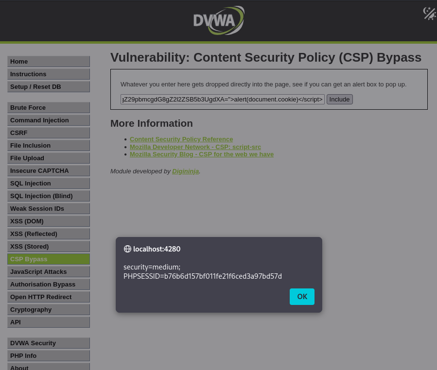

# DVWA Writeup: Content Security Policy (CSP) Bypass

## 1. Introducción
**Content Security Policy (CSP)** es una capa de seguridad (transmitida mediante cabeceras HTTP) que ayuda a detectar y mitigar ataques como el Cross-Site Scripting (XSS). Funciona indicándole al navegador exactamente desde qué fuentes se permite cargar contenido ejecutable, bloqueando todo lo demás. 

Un **CSP Bypass** ocurre cuando esta política contiene configuraciones débiles o errores lógicos. Esto permite a un atacante saltarse el filtro de seguridad y ejecutar su propio código malicioso (como JavaScript) en el navegador de la víctima.

---

## 2. Solución Nivel Medium

En este nivel, la aplicación nos proporciona un campo de texto y nos reta a intentar ejecutar un *alert box* (una ventana emergente de JavaScript).

### Análisis de la Protección
Si intentamos inyectar un script básico (como `<script>alert(1)</script>`), el navegador lo bloqueará por defecto gracias a la política CSP. 

Sin embargo, al analizar cómo funciona el filtro en este nivel *Medium*, vemos que la política utiliza un atributo llamado `nonce` (number used once) para permitir la ejecución de ciertos scripts en línea. El fallo crítico de seguridad aquí es que el servidor no está generando un `nonce` aleatorio y único por cada petición, sino que utiliza un valor estático y predecible en Base64: `TmV2ZXIgZ29pbmcgdG8gZ2l2ZSB5b3UgdXA=`.

### Explotación (Bypass)
Sabiendo que el navegador confía ciegamente en cualquier script que lleve exactamente ese `nonce` estático, lo único que tenemos que hacer es añadirlo a nuestra propia etiqueta maliciosa.

Utilizamos el siguiente payload para robar la cookie de sesión:
```html
<script nonce="TmV2ZXIgZ29pbmcgdG8gZ2l2ZSB5b3UgdXA=">alert(document.cookie)</script>
```

Al introducir este código en el campo de texto y hacer clic en **Include**, el navegador lee nuestro script, comprueba que el `nonce` coincide con el que tiene permitido en su política CSP, y lo ejecuta sin bloquearlo. 

Como resultado, la aplicación nos muestra una alerta emergente revelando nuestras cookies de sesión (`security=medium` y el `PHPSESSID`), confirmando que hemos vulnerado la política CSP con éxito.

