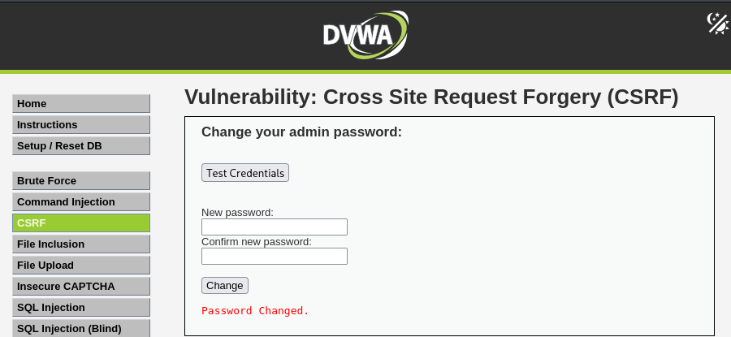

# DVWA Writeup: Cross Site Request Forgery (CSRF)

## 1. Introducción
**Cross Site Request Forgery (CSRF)** es una vulnerabilidad web que obliga al navegador de la víctima a ejecutar acciones no deseadas en una aplicación en la que actualmente está autenticada. 

Como los navegadores envían automáticamente las cookies de sesión con cada petición a un dominio, si la víctima visita una página web maliciosa creada por el atacante, esta página puede falsificar una petición legítima hacia la aplicación vulnerable. El servidor la aceptará creyendo que el usuario legítimo la ha solicitado intencionadamente.

---

## 2. Solución Nivel Medium

En este reto, tenemos un formulario simple para cambiar nuestra contraseña de administrador introduciendo una nueva y confirmándola.

### Análisis de la Protección
En el nivel *Low*, bastaba con alojar un formulario HTML malicioso en cualquier servidor externo y enviárselo a la víctima. Sin embargo, en el nivel *Medium*, los desarrolladores han implementado una medida de seguridad adicional: **la comprobación de la cabecera `Referer`**. 

Si miramos el código fuente de la aplicación, veremos que el servidor verifica de dónde proviene la petición. Si el dominio de origen de la petición (el *Referer*) no coincide con el dominio del propio servidor web, la petición es rechazada.

### Explotación (Bypass)
Para bypassear esta protección, necesitamos que nuestra petición maliciosa se envíe desde el mismo origen que la aplicación vulnerable. La forma más elegante de lograr esto es combinar esta vulnerabilidad con otra: **File Upload** (Subida de Archivos).

1. Creamos nuestro payload malicioso en un archivo llamado `csrf.html` (o `.php` si el servidor lo requiere). Este código contiene un formulario oculto que se envía automáticamente (`onload="document.forms[0].submit()"`) con la nueva contraseña que queremos imponerle a la víctima (`pwned`):

```html
<html>
  <body onload="document.forms[0].submit()">
    <form action="http://192.168.170.131/vulnerabilities/csrf/" method="GET">
      <input type="hidden" name="password_new" value="pwned" />
      <input type="hidden" name="password_conf" value="pwned" />
      <input type="hidden" name="Change" value="Change" />
    </form>
  </body>
</html>
```

2. Nos dirigimos a la sección **File Upload** de DVWA (bajando temporalmente la seguridad a *Low* si el filtro de subida es muy estricto) y subimos nuestro archivo `csrf.html` al servidor.
3. El servidor nos devolverá la ruta donde ha guardado nuestro archivo malicioso (por ejemplo: `http://127.0.0.1:4280/hackable/uploads/csrf.html`).
4. Solo tenemos que acceder a esa URL (o enviársela a la víctima logueada). Al cargar la página alojada en el propio servidor, la cabecera `Referer` será válida, el script se ejecutará automáticamente y la contraseña cambiará sin que el usuario interactúe.

El sistema nos confirmará el éxito de la inyección con el mensaje en rojo: **Password Changed**.

