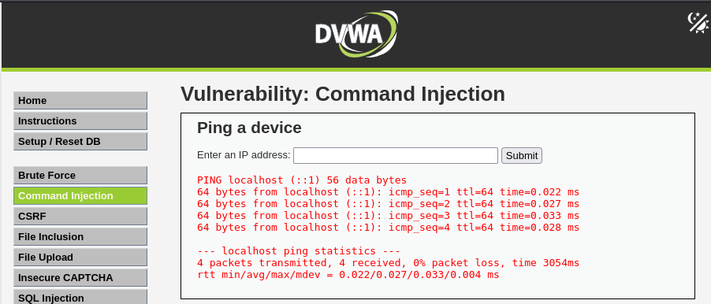
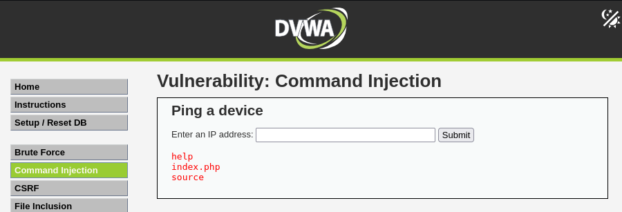

# DVWA Writeup: Command Injection

## 1. Introducción
La Inyección de Comandos (OS Command Injection) es una vulnerabilidad crítica que ocurre cuando una aplicación web pasa datos inseguros suministrados por el usuario a una consola del sistema (shell). Esto permite a un atacante ejecutar comandos directamente en el sistema operativo del servidor que aloja la aplicación web, comprometiendo potencialmente toda la infraestructura.

---

## 2. Solución (Niveles Low, Medium y High)

En este reto se nos presenta una funcionalidad que simula una herramienta de red básica para hacer un `ping` a un dispositivo. Se nos pide introducir una dirección IP o un dominio.

### Comportamiento Normal
Si introducimos un valor local esperado, como `localhost` (o la IP `127.0.0.1`), la aplicación ejecuta el comando en el backend y nos devuelve la salida estándar del sistema, mostrando los paquetes enviados y recibidos.

### Análisis y explotación
Al tratarse de una vulnerabilidad de inyección de comandos, podemos deducir que el backend está tomando nuestro input (la IP) y concatenándolo directamente a un comando `ping` del sistema operativo para ejecutarlo. 

Para ejecutar nuestro propio código, podemos aprovecharnos de los operadores de control de la consola. En este caso, el uso de la tubería o pipe (`|`) nos permite indicarle al sistema que procese un comando adicional.

El payload más sencillo para comprobar la vulnerabilidad es intentar listar los archivos del directorio actual:

`| ls`

*(Dependiendo de cómo concatene el sistema, también puede funcionar `|ls` sin espacio)*

Al introducir este payload y enviarlo, el servidor ejecuta nuestro comando `ls`. Como podemos observar en el resultado devuelto por la aplicación, en lugar de mostrar las estadísticas del ping, el servidor nos devuelve el contenido de su directorio actual, confirmando que la ejecución de comandos ha sido un éxito:
* `help`
* `index.php`
* `source`

