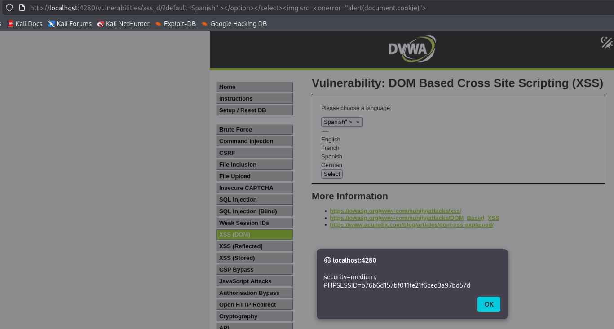

# DVWA Writeup: DOM Based Cross Site Scripting (XSS)

## 1. Introducción
**DOM Based XSS** (Cross-Site Scripting basado en el DOM) es una variante de XSS donde la vulnerabilidad reside enteramente en el código del lado del cliente (el JavaScript que se ejecuta en el navegador), y no en el servidor. 

Ocurre cuando la aplicación web toma datos controlados por el usuario (como parte de la URL) y los pasa a un sumidero de ejecución (sink) que procesa esos datos de forma insegura, modificando el "Document Object Model" (DOM) de la página y permitiendo la ejecución de código malicioso.

---

## 2. Solución Nivel Medium

En este reto se nos presenta un menú desplegable para elegir un idioma. Al seleccionar uno, vemos que la página se recarga y el idioma elegido se refleja en la URL a través del parámetro GET `default` (ej. `?default=Spanish`).

### Análisis de la protección
En el nivel *Low*, podríamos inyectar un simple `<script>alert(1)</script>` en la URL y funcionaría. Sin embargo, en el nivel *Medium*, los desarrolladores han implementado un filtro que detecta y bloquea explícitamente las etiquetas `<script>`.

Además, si analizamos el código fuente de la página, veremos que el valor del parámetro `default` se está inyectando directamente dentro de la etiqueta `<option>` del menú desplegable de idiomas. Por lo tanto, nuestro código se queda "atrapado" dentro de esa estructura HTML.

### Explotación (Bypass)
Para lograr la ejecución de nuestro código, debemos realizar dos pasos en nuestro payload:
1. **Escapar de la estructura actual:** Cerrar manualmente las etiquetas `<option>` y `<select>` que nos mantienen atrapados.
2. **Usar un vector alternativo:** Como la etiqueta `<script>` está prohibida, utilizaremos una etiqueta de imagen (``) con un atributo `onerror`. Le diremos al navegador que intente cargar una imagen que no existe (`src=x`) para forzar un error y que, al fallar, ejecute nuestro código JavaScript.

**Payload utilizado:**
```html
" ></option></select>
```

Inyectamos este payload directamente en la barra de direcciones de nuestro navegador, justo después del parámetro `default=Spanish`:
`http://localhost:4280/vulnerabilities/xss_d/?default=Spanish" ></option></select>`

Al cargar la URL, el navegador interpreta el cierre del menú desplegable e intenta renderizar la imagen defectuosa. Esto dispara el evento `onerror`, ejecutando nuestra alerta y mostrándonos en pantalla las cookies de sesión (`security=medium` y `PHPSESSID`), completando el ataque con éxito.

