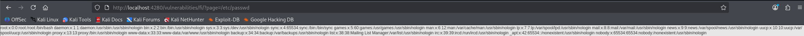

# DVWA Writeup: File Inclusion

## 1. Introducción
La vulnerabilidad de **File Inclusion** (Inclusión de Archivos) ocurre cuando una aplicación web permite al usuario controlar dinámicamente qué archivo se carga o se ejecuta en el servidor. 

Existen dos tipos principales:
* **Local File Inclusion (LFI):** Permite a un atacante leer archivos confidenciales locales del propio servidor (como contraseñas, configuraciones o logs).
* **Remote File Inclusion (RFI):** Permite incluir y ejecutar archivos alojados en un servidor remoto controlado por el atacante, lo que suele derivar en la ejecución remota de código (RCE).

---

## 2. Solución Nivel Medium

En este reto, observamos que la URL utiliza un parámetro GET llamado `page` para determinar qué archivo PHP debe cargar la página web (por ejemplo, `?page=include.php`).

### Análisis de la protección
Si analizamos el comportamiento del nivel *Medium*, los desarrolladores han intentado mitigar los ataques de *Path Traversal* (usar `../` para retroceder directorios) y de RFI (bloqueando prefijos como `http://` o `https://`). 

Sin embargo, el filtro implementado es deficiente porque **no bloquea las rutas absolutas** del sistema operativo.

### Explotación (Bypass)
Dado que el servidor está basado en Linux (como sabemos por los retos anteriores), podemos intentar leer un archivo de sistema conocido proporcionando su ruta absoluta directamente desde el directorio raíz (`/`). El objetivo clásico para demostrar una vulnerabilidad LFI es el archivo `/etc/passwd`, que contiene la lista de usuarios del sistema operativo.

Para explotarlo, simplemente modificamos el parámetro `page` en la URL con nuestro payload objetivo:

**URL maliciosa utilizada:**
```text
http://localhost:4280/vulnerabilities/fi/?page=/etc/passwd
```

Al introducir esta URL y enviar la petición, el servidor obedece nuestra instrucción de incluir el archivo. Como podemos ver en la respuesta, la página web nos devuelve directamente en texto plano todo el contenido del archivo `/etc/passwd` del servidor, revelando usuarios como `root`, `daemon`, `www-data`, entre otros. 

Esto confirma una vulnerabilidad crítica de Local File Inclusion (LFI).

