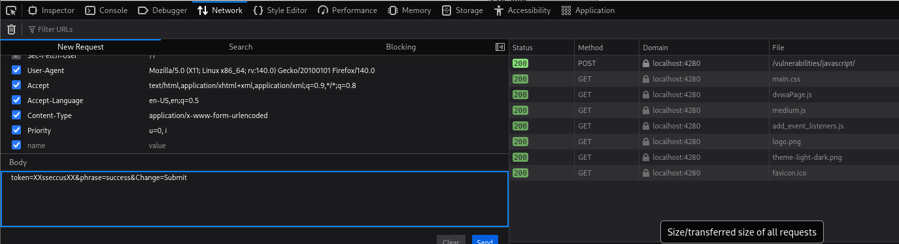
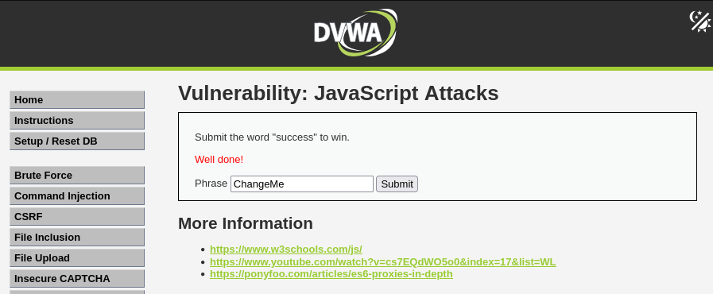

# DVWA Writeup: JavaScript Attacks

## 1. Introducción
Los **JavaScript Attacks** en este contexto no se refieren a inyectar código malicioso (como en XSS), sino a analizar, comprender y manipular la lógica del código JavaScript que se ejecuta en el lado del cliente (el navegador). 

A menudo, los desarrolladores delegan validaciones de seguridad o la generación de *tokens* al JavaScript del frontend. Como todo este código es visible y manipulable por el usuario, un atacante puede hacer ingeniería inversa para descubrir cómo se calcula esa información y falsificar peticiones válidas para engañar al servidor.

---

## 2. Solución Nivel Medium

En este reto, el objetivo es muy directo: enviar la palabra `success` al servidor para "ganar". Sin embargo, si simplemente escribimos "success" en la caja de texto y le damos a enviar, el servidor rechaza la petición por tener un token inválido.

### Análisis de la protección
Si probamos a enviar la palabra por defecto (`ChangeMe`) e inspeccionamos la petición, nos damos cuenta de que el frontend está generando y enviando un parámetro `token` oculto. 

Para la frase `ChangeMe`, el token que genera el nivel *Medium* es `XXeMegnahCXX`. Si observamos con detenimiento este resultado, la lógica de ofuscación o cifrado que está usando el JavaScript es bastante simple:
1. Toma la palabra original.
2. Invierte el orden de los caracteres (le da la vuelta).
3. Le añade el string `XX` al principio y al final.

### Preparación del payload
Sabiendo exactamente cómo funciona el algoritmo del lado del cliente, podemos calcular manualmente cuál debería ser el token correcto y esperado por el servidor para nuestra palabra ganadora (`success`):
* Palabra original: `success`
* Palabra invertida: `sseccus`
* Token calculado: `XXsseccusXX`

### Explotación (Bypass)
Para enviar esta combinación exacta al servidor y saltarnos la restricción de la interfaz, podemos modificar la petición directamente utilizando las herramientas de desarrollador del navegador.

1. Escribimos la palabra `success` en la caja y le damos a **Submit** (nos dará error).
2. Abrimos las Herramientas de Desarrollador (F12) y vamos a la pestaña **Network** (Red).
3. Buscamos la petición `POST` enviada a `/vulnerabilities/javascript/`, hacemos clic derecho y seleccionamos **Editar y reenviar**.
4. En el cuerpo de la petición (Body), modificamos los datos para inyectar el token que hemos calculado:

```text
token=XXsseccusXX&phrase=success&Change=Submit
```



5. Hacemos clic en **Send** (Enviar) para lanzar nuestra petición manipulada al servidor.
6. Si navegamos de vuelta a la página o revisamos la respuesta, veremos que el servidor ha validado nuestro token inventado y nos felicita con el mensaje en rojo: **Well done!**.

