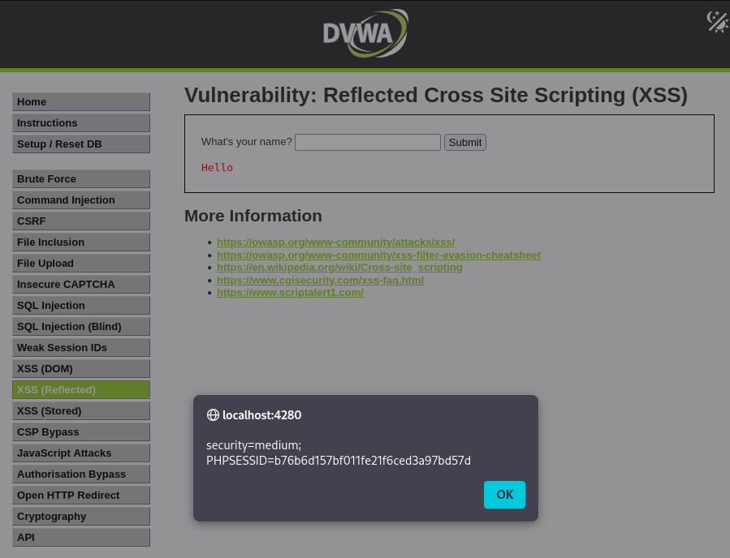

# DVWA Writeup: Reflected Cross Site Scripting (XSS)

## 1. Introducción
El **Reflected XSS** (Cross-Site Scripting Reflejado) es una vulnerabilidad web que ocurre cuando una aplicación recibe datos suministrados por el usuario a través de una solicitud HTTP y los incluye de forma inmediata e insegura en la página web de respuesta. 

A diferencia del *Stored XSS* (donde el código malicioso se guarda en el servidor), aquí el ataque ocurre en tiempo real. El código inyectado "rebota" o se refleja desde el servidor web de vuelta al navegador de la víctima, ejecutándose en el contexto de su sesión.

---

## 2. Solución Nivel Medium

En este reto, la aplicación nos presenta un formulario con un solo campo de texto que nos pregunta nuestro nombre ("What's your name?"). Al introducir un texto y enviarlo, la página se recarga y nos saluda reflejando exactamente lo que hemos escrito (ej. "Hello Alex").

### Análisis de la protección y explotación
En el nivel *Medium*, los desarrolladores han implementado un filtro de seguridad que bloquea o elimina activamente la etiqueta estándar `<script>`. Si intentamos inyectar un `<script>alert(1)</script>`, no funcionará.

Para evadir esta restricción (bypass), debemos utilizar un vector de ataque alternativo que no dependa de esa etiqueta La técnica más efectiva es utilizar eventos HTML dentro de una etiqueta de imagen (``).

**Payload utilizado:**
```html

```

**¿Por qué funciona este payload?**
1. Inyectamos una etiqueta para cargar una imagen, pero le damos una ruta o fuente inválida de forma intencionada (`src=x`).
2. El navegador intenta cargar esa imagen y, lógicamente, falla.
3. Este fallo activa automáticamente el evento `onerror` de la etiqueta.
4. El atributo `onerror` contiene nuestro código JavaScript malicioso, por lo que el navegador lo ejecuta al instante como respuesta al error de carga.

Al pegar este payload en la caja de texto y hacer clic en **Submit**, el servidor nos devuelve la página. El navegador intenta procesar nuestro "nombre", falla al cargar la imagen falsa y ejecuta el evento. Como resultado, vemos saltar una ventana emergente (alert box) que nos muestra las cookies de sesión actuales (`security=medium` y `PHPSESSID`), confirmando el éxito del ataque.

