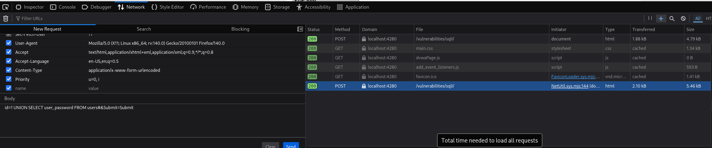
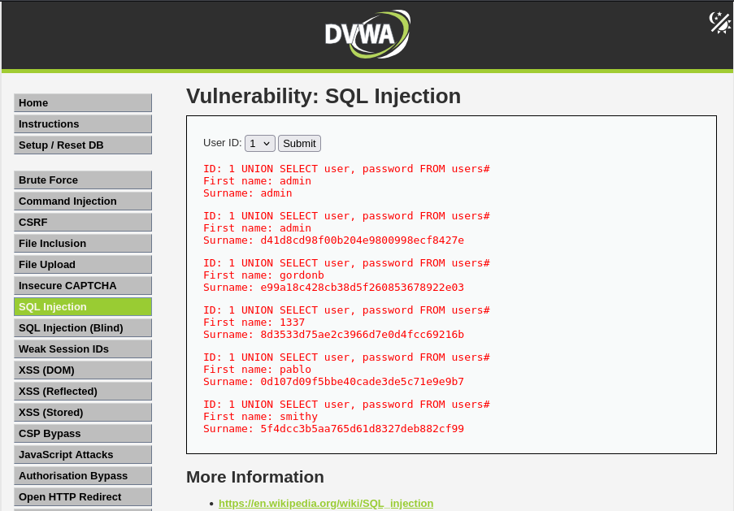

# DVWA Writeup: SQL Injection

## 1. Introducción
La **Inyección SQL (SQLi)** es una vulnerabilidad crítica que permite a un atacante interferir en las consultas que una aplicación web realiza a su base de datos. 

Ocurre cuando la entrada del usuario no se sanea correctamente y se concatena directamente dentro de una sentencia SQL. Esto permite inyectar comandos SQL arbitrarios para leer, modificar o eliminar datos a los que normalmente no se tendría acceso, como tablas de usuarios, contraseñas o información confidencial.

---

## 2. Solución Nivel Medium

En este reto, la aplicación nos permite seleccionar un ID de usuario a través de un menú desplegable para ver su nombre y apellido. 

### Análisis de la protección
Al subir al nivel *Medium*, notamos dos grandes cambios:
1. **La interfaz:** Ya no tenemos una caja de texto libre, sino un menú `<select>` cerrado, lo que impide escribir la inyección de forma normal.
2. **El método HTTP:** La aplicación ahora usa una petición `POST` en lugar de `GET`, por lo que el parámetro no viaja visible en la URL.
3. **El filtro:** El backend utiliza funciones (como `mysqli_real_escape_string`) para escapar las comillas simples (`'`), intentando neutralizar las inyecciones básicas.

El fallo crítico aquí es que el parámetro `id` se trata como un valor numérico (entero) en la consulta SQL del backend (ej: `SELECT first_name, last_name FROM users WHERE user_id = $id`). Al no estar envuelto en comillas en el código original, **no necesitamos usar comillas para romper la consulta**.

### Explotación (Bypass)
Dado que no podemos escribir en la interfaz web, manipularemos la petición HTTP antes de que llegue al servidor utilizando las Herramientas de Desarrollador del navegador.

1. Seleccionamos un ID cualquiera en el menú desplegable y le damos a **Submit**.
2. Abrimos las herramientas del navegador (F12) y vamos a la pestaña **Network** (Red).
3. Buscamos la petición `POST` enviada a `/vulnerabilities/sqli/`, hacemos clic derecho y seleccionamos **Editar y reenviar**.
4. En el cuerpo de la petición (Body), modificamos el parámetro `id` con nuestro payload:

**Payload utilizado:**
```text
id=1 UNION SELECT user, password FROM users#&Submit=Submit
```

**¿Qué hace este payload?**
* `1`: Ejecuta la consulta normal para el usuario 1.
* `UNION`: Es un operador SQL que combina los resultados de la consulta original con los resultados de una nueva consulta que le indiquemos.
* `SELECT user, password FROM users`: Nuestra consulta inyectada para extraer los nombres de usuario y los hashes de sus contraseñas de la base de datos.
* `#`: En MySQL, la almohadilla sirve para comentar el resto de la línea, ignorando cualquier código sobrante que la aplicación intente añadir al final de la consulta.



5. Enviamos la petición modificada haciendo clic en **Send**.
6. Al revisar la respuesta de la página web, veremos que la inyección ha sido un éxito. La aplicación nos devuelve no solo el nombre del ID 1, sino que, gracias al operador `UNION`, nos escupe toda la lista de usuarios y los hashes de sus contraseñas en pantalla.

