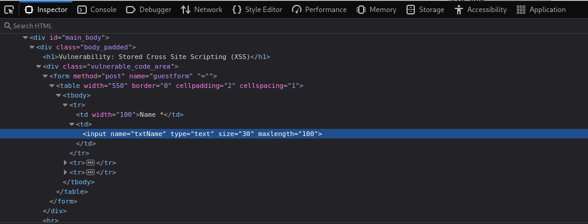
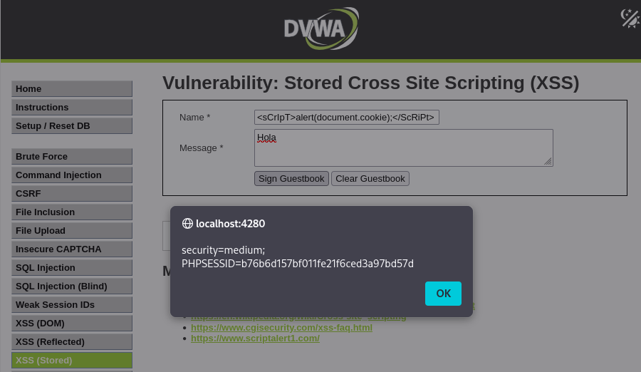

# DVWA Writeup: Stored Cross Site Scripting (XSS)

## 1. Introducción
El **Stored XSS** (Cross-Site Scripting Almacenado o Persistente) es una vulnerabilidad web crítica en la que el código malicioso inyectado por el atacante se guarda de forma permanente en los servidores de la aplicación objetivo (por ejemplo, en una base de datos, en un foro, o en un libro de visitas). 


A diferencia del *Reflected XSS*, donde el ataque requiere que la víctima haga clic en un enlace manipulado, en el *Stored XSS* el payload malicioso se sirve automáticamente a cualquier usuario legítimo que simplemente navegue por la página web infectada, ejecutándose en su navegador de forma silenciosa.

---

## 2. Solución Nivel Medium

En este reto, la aplicación nos presenta un "Libro de Visitas" (Guestbook) con dos campos para rellenar: un Nombre (*Name*) y un Mensaje (*Message*).

### Análisis de la protección
Al subir la seguridad al nivel *Medium*, los desarrolladores han implementado un par de obstáculos:
1. **Filtro del lado del servidor:** Han añadido una función que busca y elimina la etiqueta exacta `<script>` para evitar inyecciones directas.
2. **Restricción del lado del cliente:** El campo HTML del "Nombre" tiene un atributo `maxlength` muy restrictivo que nos impide escribir textos largos, cortando nuestro payload por la mitad antes de que podamos enviarlo.

### Preparación y evasión (Bypass)
Para lograr que nuestro ataque funcione, colocaremos nuestra inyección en el campo "Name", superando ambas protecciones paso a paso.

**Paso 1: Bypassear el límite de caracteres (Client-Side)**
Dado que la restricción de longitud está en el código HTML de nuestro propio navegador, podemos alterarla fácilmente:
1. Hacemos clic derecho sobre el cuadro de texto de **Name** y seleccionamos **Inspeccionar** (o pulsamos F12).
2. En la herramienta del Inspector, localizamos la etiqueta `<input>` correspondiente.
3. Modificamos el valor del atributo `maxlength` (que suele estar en 10) y lo cambiamos por `100`.



**Paso 2: Bypassear el filtro de etiquetas (Server-Side)**
El filtro del servidor es deficiente porque distingue entre mayúsculas y minúsculas. Podemos evadirlo simplemente alternando el formato de las letras de nuestra etiqueta. 

**Payload utilizado:**
```html
<sCrIpT>alert(document.cookie);</ScRiPt>
```


### Explotación y resultado
Con el límite de caracteres eliminado, pegamos nuestro payload en el campo **Name**. En el campo **Message** escribimos cualquier texto inofensivo (por ejemplo, "Hola") y hacemos clic en **Sign Guestbook**.

Al enviarlo, el servidor guarda nuestro nombre manipulado en su base de datos y recarga la página. Al intentar mostrar la lista de firmas, el navegador procesa la etiqueta `<sCrIpT>`, la reconoce como válida a pesar de las mayúsculas intercaladas, y la ejecuta. 

Como resultado, aparece instantáneamente una ventana emergente mostrando nuestras cookies de sesión (`security=medium` y `PHPSESSID`), confirmando que la vulnerabilidad Stored XSS ha sido explotada con éxito.

