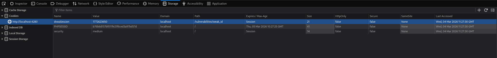
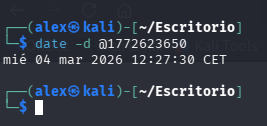

# DVWA Writeup: Weak Session IDs

## 1. Introducción
La vulnerabilidad de **Weak Session IDs** (Identificadores de Sesión Débiles) ocurre cuando una aplicación web genera cookies de sesión predecibles para mantener el estado y rastrear a los usuarios autenticados. 


Si un atacante logra deducir el patrón matemático, la secuencia o el algoritmo con el que se crean estos identificadores, puede generar una cookie válida por sí mismo y suplantar la identidad de otro usuario activo (Session Hijacking) sin necesitar su contraseña.

---

## 2. Solución Nivel Medium

En este reto, el objetivo es analizar cómo la aplicación genera un nuevo identificador de sesión cada vez que pulsamos el botón "Generate".

### Análisis de la protección
En el nivel *Low*, el identificador era un simple número predecible que comenzaba en 0 y aumentaba de uno en uno cada vez que se regeneraba. 

Al subir al nivel *Medium*, los desarrolladores han cambiado la lógica y ahora el valor de la cookie se establece utilizando el método `time()` de PHP. Esto significa que la aplicación está utilizando la marca de tiempo actual del servidor (Unix Timestamp o Epoch time, que cuenta los segundos transcurridos desde el 1 de enero de 1970) como identificador único para la sesión.

### Verificación y explotación
Para comprobar esta debilidad y demostrar que el identificador es completamente predecible, realizamos los siguientes pasos:

1. Pulsamos el botón para generar una nueva sesión en DVWA.
2. Abrimos las **Herramientas de Desarrollador** de nuestro navegador (F12) y vamos a la pestaña de **Almacenamiento** (Storage) para inspeccionar las cookies de la página.
3. Comprobamos que el servidor nos ha asignado una cookie llamada `dvwaSession` con un valor numérico de 10 dígitos: `1772623650`.



4. Para confirmar que este número no es aleatorio, sino un simple *timestamp*, copiamos el valor y abrimos una terminal en nuestra máquina atacante (Kali Linux).
5. Ejecutamos el comando `date` pasándole el valor numérico para que lo convierta a un formato legible: 
   ```bash
   date -d @1772623650
   ```
  
6. La terminal nos devuelve la fecha y hora exacta: `mié 04 mar 2026 12:27:30 CET`. Esto demuestra irrefutablemente que la "aleatoriedad" de la sesión es solo la hora del reloj del servidor.



**¿Por qué es esto crítico?** Un atacante no necesita robar tu cookie físicamente. Si un atacante sabe o sospecha que un administrador inició sesión en el sistema hoy a las 12:27, solo tiene que calcular los *timestamps* correspondientes a ese minuto (apenas 60 combinaciones posibles) y probarlos mediante un ataque de fuerza bruta hasta acertar y secuestrar la sesión del administrador con éxito.